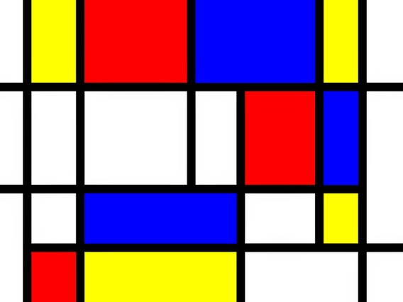

\titlepage

# Best equation ever
Hi there

$$\bm{y = X\beta + \epsilon}$$

$$
{\hat{\m\beta}} = (\m{X'X})^{-1}\m{X'}\m y
$$

# Yes

# IBP

I just cited [@griffiths2011indian].
And now I'm citing @williamson2010dependent

# List

- item 1
- item 2
